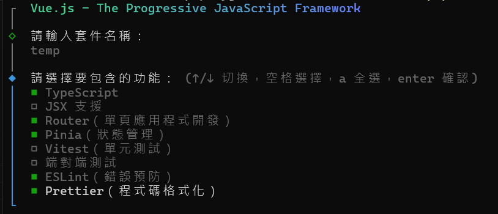
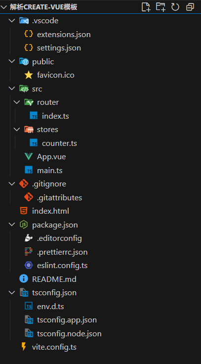

# 建立專案模板

## 使用 create-vue 建立新專案

## 目錄結構

- .editorconfig: 用於統一不同編輯器和 IDE 的基本編輯行為（如縮排、行尾符號、字元編碼等），確保團隊成員在不同開發環境下有一致的代碼格式。

- Prettier: 一個自動化的程式碼格式化工具，根據預設或自定義規則自動調整程式碼排版（如縮排、分號、引號等），提升代碼可讀性並減少格式爭議。

- ESLint: 一個靜態程式碼分析工具，主要用於檢查 JavaScript/TypeScript 代碼中的語法錯誤、潛在問題及不符合規範的寫法，並可根據規則自動修復部分問題，提升代碼品質與一致性。
