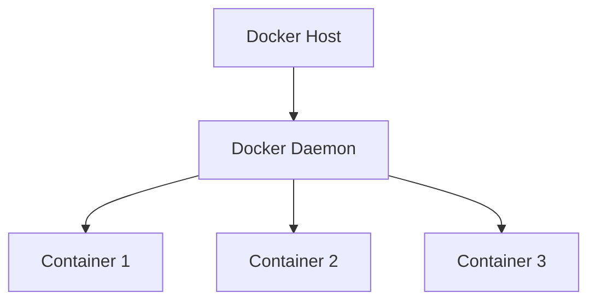
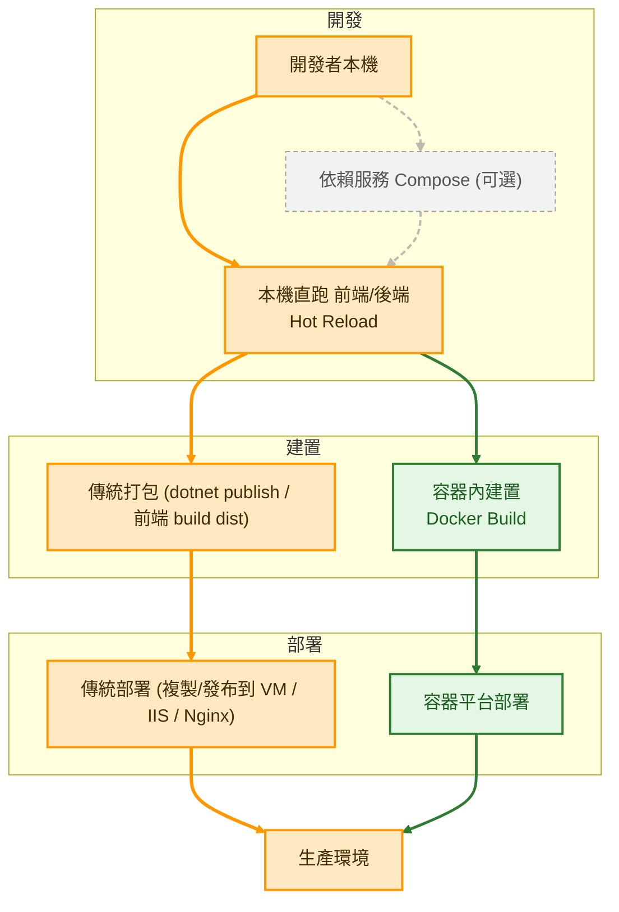

# Docker

## 理論基礎

## 使用場景

### 容器化開發

#### 透過 docker 指令

#### 透過 Docker Compose

## 導入開發流程

> 現況：本機直跑應用 + 傳統部署。
> 計畫：逐步加入依賴服務 Compose 與（可選）容器化部署。

此流程圖展示了現代開發到部署的兩條並行路線：

### 🟠 傳統部署路線

**開發者本機** → **本機直跑開發** → **傳統打包** → **傳統部署** → **生產環境**

- 適用於現有專案的穩定部署方式
- 使用熟悉的工具：dotnet publish、前端 build dist
- 部署到 VM、IIS、Nginx 等傳統環境

### 🟢 容器化路線

**開發者本機** → **本機直跑開發** → **容器內建置** → **容器平台部署** → **生產環境**

- 現代化的部署方式，提供更好的一致性
- Docker multi-stage build 確保環境統一
- 部署到 Kubernetes、Docker Swarm 等容器平台

### ⚪ 可選增強

**依賴服務 Compose**：可選擇性地使用 Docker Compose 啟動資料庫、快取、訊息佇列等依賴服務，統一版本管理並提供環境隔離。

### 流程特點

1. **並行選擇**：兩條路線可依專案需求、團隊成熟度選擇使用
2. **開發一致**：兩條路線都採用本機直跑開發，確保最佳開發體驗
3. **漸進導入**：可從傳統部署開始，逐步導入容器化技術

### 實際專案的路線選擇策略

在企業級專案中，通常會採用以下策略：

- **階段性遷移**：先使用傳統部署建立穩定基礎，再逐步遷移至容器化
- **服務分層策略**：新開發的微服務採用容器化，既有的單體應用維持傳統部署
- **環境差異化**：開發/測試環境優先容器化，生產環境在確認穩定後再遷移
- **團隊技能考量**：根據團隊對容器技術的熟悉度，選擇合適的導入時機

## 常見問題

### 為什麼不在開發階段就使用容器化？

雖然容器化有很多優點，但在開發階段仍建議使用本機直跑，原因如下：

- **開發效率**：本機環境的 Hot Reload 和即時編譯速度更快，提升開發體驗
- **除錯便利性**：直接在本機除錯比在容器內除錯更簡單直接
- **資源消耗**：容器化會增加記憶體和 CPU 使用量，影響本機其他工作
- **啟動時間**：容器建置和啟動時間較長，不適合需要頻繁重啟的開發場景
- **檔案同步**：Volume 掛載的檔案同步可能存在延遲，影響開發流暢度

容器化的價值主要體現在部署階段的環境一致性，而非開發階段的便利性。
